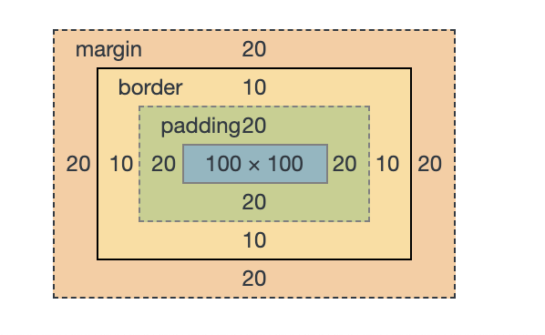
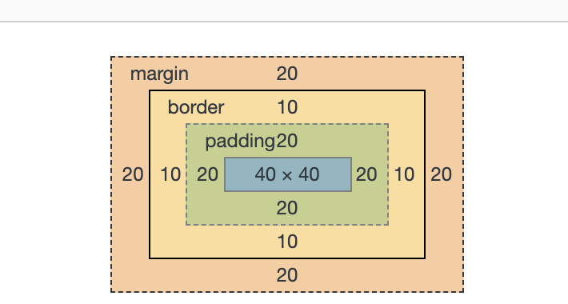

<!--
 * @Author: your name
 * @Date: 2020-02-03 11:36:17
 * @LastEditTime : 2020-02-04 18:23:39
 * @LastEditors  : Please set LastEditors
 * @Description: In User Settings Edit
 * @FilePath: /fe_blog/css/07/README.md
 -->
## css盒模型

+ 页面渲染时，dom 元素所采用的 布局模型。可通过box-sizing进行设置。根据计算宽高的区域可分为：
  - content-box (W3C 标准盒模型)
  - border-box (IE 盒模型)

```html
    <!DOCTYPE html>
    <html lang="en">
    <head>
        <meta charset="UTF-8">
        <meta name="viewport" content="width=device-width, initial-scale=1.0">
        <meta http-equiv="X-UA-Compatible" content="ie=edge">
        <title>Document</title>
        <style>
            div{
                background: #000;
                color: #fff;
                width: 100px;
                height: 100px;
                padding: 20px;
                margin: 20px;
                border:10px solid;
                box-sizing: border-box;
            }
        </style>
    </head>
    <body>
        <div id="box">111</div>
    </body>
    </html>
```
+ content-box
  - width和height不包括padding 和 border


+ border-box
  - width = border + padding
