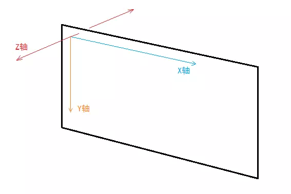
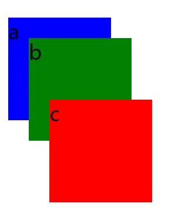
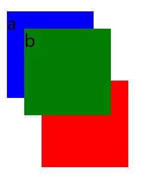
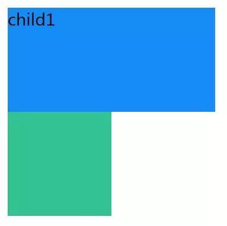
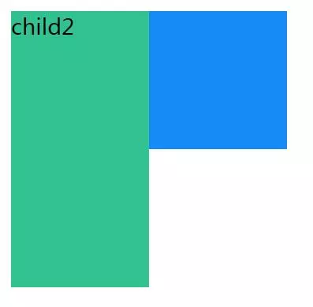
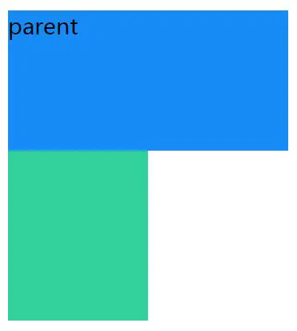
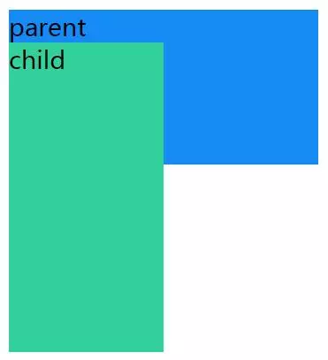

<!--
 * @Author: your name
 * @Date: 2020-02-05 15:20:51
 * @LastEditTime : 2020-02-06 15:29:30
 * @LastEditors  : Please set LastEditors
 * @Description: In User Settings Edit
 * @FilePath: /fe_blog/css/09/README.md
 -->
## CSS层叠上下文、层叠等级、层叠顺序、z-index

### 一个“片面”的理解

+ 以往，由于自己使用z-index的频率不大，所以对这个CSS属性存在比较片面的认识。一直认为z-index就是用来描述定义一个元素在屏幕Z轴上的堆叠顺序。z-index值越大在Z轴上就越靠上，也就是离屏幕观察者越近。最后才发现这个认识存在很大的问题：
  - 1.首先，z-index属性值并不是在任何元素上都有效果。它仅在定位元素（定义了position属性，且属性值为非static值的元素）上有效果。
  - 2.判断元素在Z轴上的堆叠顺序，不仅仅是直接比较两个元素的z-index值的大小，这个堆叠顺序实际由元素的层叠上下文、层叠等级共同决定。
  
+ 要想完全理解一个东西，首先要明白它是什么，也就是它的定义。我们先看看上面提到的层叠上下文、层叠等级、层叠顺序都是什么？定义又太过抽象，后面会再用一个具象的比喻来让你彻底明白它们到底是什么，有什么联系。

### 什么是“层叠上下文”
+ 层叠上下文(stacking context)，是HTML中一个三维的概念。在CSS2.1规范中，每个盒模型的位置是三维的，分别是平面画布上的X轴，Y轴以及表示层叠的Z轴。一般情况下，元素在页面上沿X轴Y轴平铺，我们察觉不到它们在Z轴上的层叠关系。而一旦元素发生堆叠，这时就能发现某个元素可能覆盖了另一个元素或者被另一个元素覆盖。

+ 如果一个元素含有层叠上下文，(也就是说它是层叠上下文元素)，我们可以理解为这个元素在Z轴上就“高人一等”，最终表现就是它离屏幕观察者更近。

### 什么是“层叠等级”

+ 在同一个层叠上下文中，它描述定义的是该层叠上下文中的层叠上下文元素在Z轴上的上下顺序。
+ 在其他普通元素中，它描述定义的是这些普通元素在Z轴上的上下顺序。

#### 再类比回“层叠上下文”和“层叠等级”，就得出一个结论：
+ 1.普通元素的层叠等级优先由其所在的层叠上下文决定
+ 2.层叠等级的比较只有在当前层叠上下文元素中才有意义。不同层叠上下文中比较层叠等级是没有意义的。

### 如何产生“层叠上下文”
+ 前面说了那么多，知道了“层叠上下文”和“层叠等级”，其中还有一个最关键的问题：到底如何产生层叠上下文呢？如何让一个元素变成层叠上下文元素呢？
+ 其实，层叠上下文也基本上是有一些特定的CSS属性创建的，一般有3种方法：
  - 1.HTML中的根元素<html></html>本身j就具有层叠上下文，称为“根层叠上下文”。
  - 2.普通元素设置position属性为非static值并设置z-index属性为具体数值，产生层叠上下文。
  - 3.CSS3中的新属性也可以产生层叠上下文。


+ 至此，终于可以上代码了，我们用代码说话，来验证上面的结论：

+ 栗子1: 有两个div，p.a、p.b被包裹在一个div里，p.c被包裹在另一个盒子里，只为.a、.b、.c设置position和z-index属性
```html
    <style>
  div {  
    position: relative;  
    width: 100px;  
    height: 100px;  
  }  
  p {  
    position: absolute;  
    font-size: 20px;  
    width: 100px;  
    height: 100px;  
  }  
  .a {  
    background-color: blue;  
    z-index: 1;  
  }  
  .b {  
    background-color: green;  
    z-index: 2;  
    top: 20px;  
    left: 20px;  
  }  
  .c {  
    background-color: red;  
    z-index: 3;  
    top: -20px;  
    left: 40px;  
  }
</style>

<body>  
  <div>  
    <p class="a">a</p>  
    <p class="b">b</p>  
  </div> 

  <div>  
    <p class="c">c</p>  
  </div>  
</body> 

```
+ 效果：


+ 因为p.a、p.b、p.c三个的父元素div都没有设置z-index，所以不会产生层叠上下文，所以.a、.b、.c都处于由<html></html>标签产生的“根层叠上下文”中，属于同一个层叠上下文，此时谁的z-index值大，谁在上面。

+ 栗子2： 有两个div，p.a、p.b被包裹在一个div里，p.c被包裹在另一个盒子里，同时为两个div和.a、.b、.c设置position和z-index属性 
```html
    <style>
  div {
    width: 100px;
    height: 100px;
    position: relative;
  }
  .box1 {
    z-index: 2;
  }
  .box2 {
    z-index: 1;
  }
  p {
    position: absolute;
    font-size: 20px;
    width: 100px;
    height: 100px;
  }
  .a {
    background-color: blue;
    z-index: 100;
  }
  .b {
    background-color: green;
    top: 20px;
    left: 20px;
    z-index: 200;
  }
  .c {
    background-color: red;
    top: -20px;
    left: 40px;
    z-index: 9999;
  }
</style>

<body>
  <div class="box1">
    <p class="a">a</p>
    <p class="b">b</p>
  </div>

  <div class="box2">
    <p class="c">c</p>
  </div>
</body>

```
+ 效果：


+ 我们发下，虽然p.c元素的z-index值为9999，远大于p.a和p.b的z-index值，但是由于p.a、p.b的父元素div.box1产生的层叠上下文的z-index的值为2，p.c的父元素div.box2所产生的层叠上下文的z-index值为1，所以p.c永远在p.a和p.b下面。

+ 同时，如果我们只更改p.a和p.b的z-index值，由于这两个元素都在父元素div.box1产生的层叠上下文中，所以，谁的z-index值大，谁在上面。


### 什么是“层叠顺序”
+ 说完“层叠上下文”和“层叠等级”，我们再来说说“层叠顺序”。“层叠顺序”(stacking order)表示元素发生层叠时按照特定的顺序规则在Z轴上垂直显示。由此可见，前面所说的“层叠上下文”和“层叠等级”是一种概念，而这里的“层叠顺序”是一种规则。


+ 在不考虑CSS3的情况下，当元素发生层叠时，层叠顺讯遵循上面途中的规则。 这里值得注意的是：
  - 1.左上角"层叠上下文background/border"指的是层叠上下文元素的背景和边框。
  - 2.inline/inline-block元素的层叠顺序要高于block(块级)/float(浮动)元素。
  - 3.单纯考虑层叠顺序，z-index: auto和z-index: 0在同一层级，但这两个属性值本身是有根本区别的。


+ 栗子3：
```html
    <style>
  .box1, .box2 {
    position: relative;
    z-index: auto;
  }
  .child1 {
    width: 200px;
    height: 100px;
    background: #168bf5;
    position: absolute;
    top: 0;
    left: 0;
    z-index: 2;
  }
  .child2 {
    width: 100px;
    height: 200px;
    background: #32c292;
    position: absolute;
    top: 0;
    left: 0;
    z-index: 1;
  }
</style>
</head>

<body>
  <div class="box1">
    <div class="child1"></div>
  </div>

  <div class="box2">
    <div class="child2"></div>
  </div>
</body>

```

效果：

+ 说明：.box1/.box2虽然设置了position: relative，但是z-index: auto的情况下，这两个div还是普通元素，并没有产生层叠上下文。所以，child1/.child2属于<html></html>元素的“根层叠上下文”中，此时，谁的z-index值大，谁在上面。


+ 栗子4:
  - 对于栗子1中的CSS代码，我们只把.box1/.box2的z-index属性值改为数值0，其余不变。
  ```html
    .box1, .box2 {
        position: relative;
        z-index: 0;
        }
    ...
  ```
  - 效果：
  
  - 说明： 此时，我们发现，仅仅修改了.box1/.box2的z-index属性值改为数值0，最终结果完全相反。这时.child2覆盖在了.child1上面。原因是什么呢？很简单：因为设置z-index: 0后，.box1/.box2产生了各自的层叠上下文，这时候要比较.child1/.child2的层叠关系完全由父元素.box1/.box2的层叠关系决定。但是.box1/.box2的z-index值都为0，都是块级元素（所以它们的层叠等级，层叠顺序是相同的），这种情况下，在DOM结构中后面的覆盖前面的，所以.child2就在上面。

### CSS3中的属性对层叠上下文的影响
+ CSS3中出现了很多新属性，其中一些属性对层叠上下文也产生了很大的影响。如下：
  - 1.父元素的display属性值为flex|inline-flex，子元素z-index属性值不为auto的时候，子元素为层叠上下文元素；
  - 2.元素的opacity属性值不是1；
  - 3.元素的transform属性值不是none；
  - 4.元素mix-blend-mode属性值不是normal`；
  - 5.元素的filter属性值不是none；
  - 6.元素的isolation属性值是isolate；
  - 7.will-change指定的属性值为上面任意一个；
  - 8.元素的-webkit-overflow-scrolling属性值设置为touch。

+ CSS3中，元素属性满足以上条件之一，就会产生层叠上下文。我们用第1条来做一个简单的解释说明。
```html
    <style>
  .box {
  }
  .parent {
    width: 200px;
    height: 100px;
    background: #168bf5;
    /* 虽然设置了z-index，但是没有设置position，z-index无效，.parent还是普通元素，没有产生层叠上下文 */
    z-index: 1;
  }
  .child {
    width: 100px;
    height: 200px;
    background: #32d19c;
    position: relative;
    z-index: -1;
  }
</style>
</head>

<body>
  <div class="box">
    <div class="parent">
      parent
      <div class="child">child</div>
    </div>
  </div>
</body>

```
+ 效果：

+ 说明： 我们发现，.child被.parent覆盖了。按照“套路”来分析一下：
虽然.parent设置了z-index属性值，但是没有设置position属性，z-index无效，所以没有产生层叠上下文，.parent还是普通的块级元素。此时，在层叠顺序规则中，z-index值小于0的.child会被普通的block块级元素.parent覆盖。


+ 栗子6：
  - 对于上面的栗子，我们只修改.box的属性，设置display: flex，其余属性和DOM结构不变。
  ```css
    .box {
        display: flex;
        }

  ```
  + 效果：
  
  + 说明： 当给.box设置display: flex时，.parent就变成层叠上下文元素，根据层叠顺序规则，层叠上下文元素的background/border的层叠等级小于z-index值小于0的元素的层叠等级，所以z-index值为-1的.child在.parent上面。
