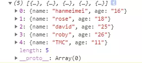
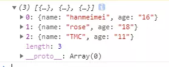

<!--
 * @Author: your name
 * @Date: 2020-02-09 15:17:07
 * @LastEditTime : 2020-02-09 15:25:01
 * @LastEditors  : Please set LastEditors
 * @Description: In User Settings Edit
 * @FilePath: /fe_blog/js/26/README.md
 -->
## 在循环数组时使用splice()方法删除数组遇到的问题

### 在开发的时候，经常需要操作数据。需要将数组中某些目标元素删除时遇到了一些问题：

+ 假设我们有一个人员数组person，需要将元素里面age>18的元素删除

```js
    let person=[
        {name:"lilei",age:"45"},
        {name:"hanmeimei",age:"16"},
        {name:"rose",age:"18"},
        {name:"jack",age:"22"},
        {name:"david",age:"25"},
        {name:"bruce",age:"30"},
        {name:"roby",age:"26"},
        {name:"TMC",age:"11"},
        {name:"lee",age:"40"},
    ]

```

+ 现在我们使用forEach方法循环然后删除对应的目标元素
```js
    person.forEach((value,index)=>{
        if(value.age>18){
            person.splice(index,1)
        }
    })
```
+ 我们看看输出结果是什么:


+ 奇怪，好像和我们预想的结果不一样，通过调试之后发现。每次执行一次splice方法之后，person的长度就会减一，从而会导致forEach循环中的下标错乱，最终达不到我们的目标。

+ 经过查询资料，可以通过以下方法来解决这个问题：
方法一：在每次执行splice方法之后都讲当前循环的下标值减1,此方法在forEach方法中无效，至于具体原因我也不清楚，请大佬指教。使用for循环实现
```js
    for(var i=0;i<person.length;i++){
        if(person[i].age>18){
            person.splice(i--,1)
        }
    }
```



#### 方法二：使用for循环逆向遍历.这种方法相当于每次执行splice方法的时候都将数组的长度减1
```js
    for(var i=person.length-1;i>-1;i--){
        if(person[i].age>18){
            person.splice(i,1)
        }
    }

```

#### 方法三：使用数组的filter方法。filter()方法使用指定的函数测试所有元素，返回一个包含所有通过的元素新的数组
```js
    var newPerson=person.filter((p)=>p.age<=18)

```